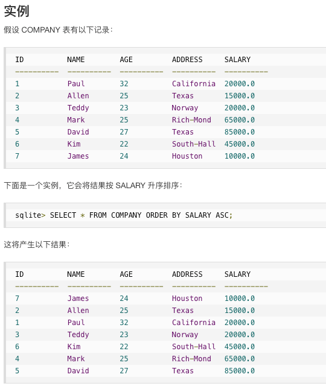
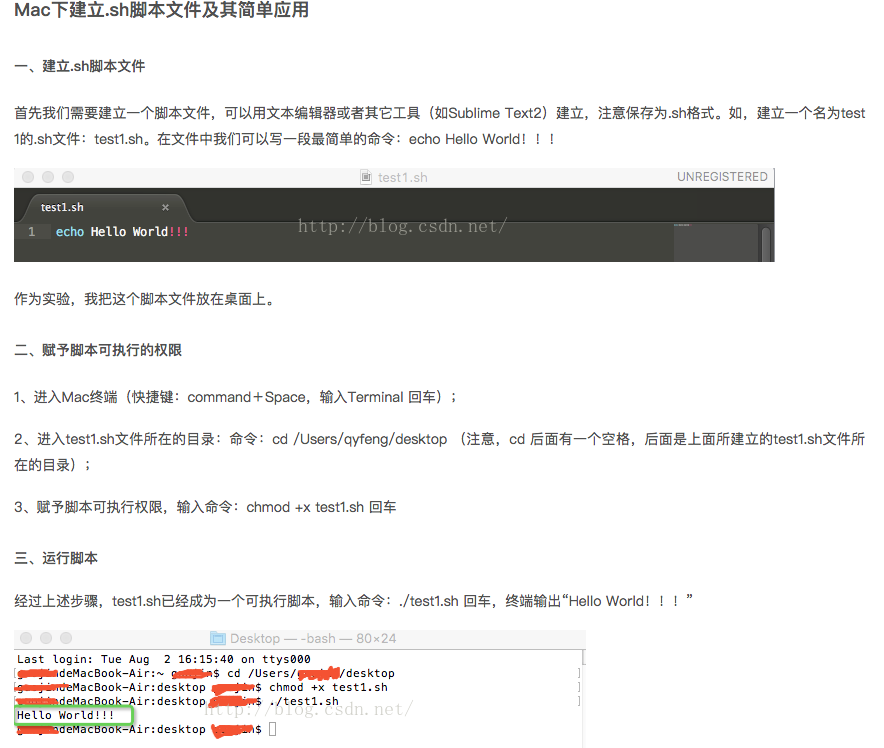

参考：https://zhuanlan.zhihu.com/p/39426683
## 1.路径：将chrome的浏览记录拷贝到自己的项目文件夹里面，否则会报错没有权限；这里的Application\ Support记得加一个反斜杠哦！
/Users/truexinology/Library/Application\ Support/Google/Chrome/Default/History

## 2.路径：/Users/truexinology/truexin/python/chrome-history-email/History

## 3.问题：提交title的时候
 ### 解决UnicodeEncodeError: 'ascii' codec can't encode characters in positio
  将字符串写入文本时出现解决UnicodeEncodeError: 'ascii' codec can't encode characters in position
 ### 解决办法：https://blog.csdn.net/yemoweiliang/article/details/52397940
  在开头加上
 ``` 
    import sys
    reload(sys)
    sys.setdefaultencoding( "utf-8" )
  ```
  
http://www.runoob.com/sqlite/sqlite-order-by.html

1.时间升降序问题：


2.sh文件运行问题：

```chmod +x test1.sh```
参考：https://blog.csdn.net/jin_kwok/article/details/52094999
